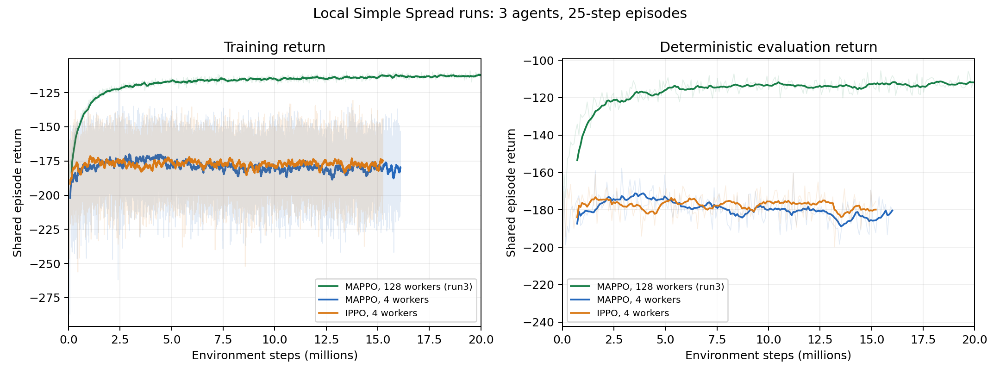

# Simple Spread reproduction experiments

This notebook-style record documents our local experiments reproducing **The Surprising Effectiveness of PPO in Cooperative Multi-Agent Games** (Yu et al.). The completed 128-worker recurrent MAPPO runs reach the paper's approximate Simple Spread return. The four-worker runs plateau substantially below it. We have not yet established a reproduction across independent seeds or completed the matching 128-worker recurrent IPPO experiment.

- [Paper](https://arxiv.org/abs/2103.01955), especially §4.2, Figure 1, and Tables 9 and 16.
- [Paper's Spread curve](https://arxiv.org/html/2103.01955v4/figures/mappo_ippo_other/spread_episode_rewards.png).
- Upstream: `https://github.com/marlbenchmark/on-policy`, inspected commit `de66d7a4b23fac2513f56f96f73b3f5cb96695ac`, plus the local changes below.
- Results snapshot: September 25, 2026. Historical runs do not all have saved resolved configurations; current script defaults should not be treated as proof of every historical run's settings.

## Environment and algorithm

We use the repository's MPE `simple_spread` environment with three agents, three landmarks, and fixed 25-step episodes. Agents receive distance penalties for uncovered landmarks and collision penalties. Individual rewards are summed into a shared team reward, which each agent receives.

Agents share actor parameters. Each actor receives an 18-dimensional local observation. MAPPO's critic receives the concatenated observations of all agents (54 dimensions); IPPO's critic receives the local observation (18 dimensions). Both execute decentralized policies.

| Setting | Current reference configuration |
| --- | --- |
| Algorithm argument | `rmappo` for both MAPPO and IPPO |
| IPPO selection | Add `--use_centralized_V` to disable centralized value inputs |
| Network | Two 64-unit fully connected layers, Tanh, one 64-unit GRU |
| Training environment steps | 20,000,000 |
| Parallel rollout environments | 128; four-worker ablation also tested |
| Rollout / episode length | 25 |
| PPO epochs / minibatches | 10 / 1 |
| Actor / critic learning rate | `7e-4` / `7e-4` |
| PPO clip / entropy coefficient | `0.2` / `0.01` |
| Discount / GAE lambda | `0.99` / `0.95` |
| Value normalization / feature normalization | Enabled / enabled |
| Advantage normalization | Enabled |
| Gradient clipping / recurrent chunk length | 10 / 10 |
| Evaluation | Deterministic actions; 20 parallel episodes per evaluation |
| Reference evaluation interval | 25 rollout/update cycles, or 80,000 environment steps |
| Logging | Local TensorBoard by default |

The reference settings follow [the upstream Spread launcher](onpolicy/scripts/train_mpe_scripts/train_mpe_spread.sh). The paper reports MPE results averaged over ten seeds; our saved run directories are not ten independent seeds.

## Metrics and interpretation

- `average_episode_rewards`: mean shared reward in the training rollout multiplied by the 25-step horizon. Training actions are sampled from the policy.
- `eval_average_episode_rewards`: shared return summed over a complete evaluation episode, averaged across environments and agents. Evaluation actions are deterministic.
- `eval_success_rate`: fraction of evaluation episodes in which every landmark is within distance **strictly less than 0.1** of some agent at least once. Coverage need not persist, and the episode still runs for 25 steps. There is no distinct-agent assignment check. This is our added diagnostic, not the paper's reported Spread metric.

With 20 evaluation episodes, a single success estimate changes in increments of 5 percentage points. `--eval_episodes` does not control this MPE runner's evaluation count; `--n_eval_rollout_threads` does.

Negative returns are expected. The inherited scenario's collision loop includes the agent itself, contributing a constant shared penalty of -75 per three-agent, 25-step episode. We have preserved this behavior and the reward scale for comparison with the reference implementation. A return of zero is not the appropriate target.

## Experiment history and results

Paths below are relative to `onpolicy/scripts/results/MPE/simple_spread/`. Returns and success rates are averages of the final ten **logged evaluation points**, not averages across seeds or confidence intervals. Evaluation is periodic, so its last step precedes the training endpoint.

| Run | Configuration | Progress | Last evaluation step | Evaluation return | Success |
| --- | --- | --- | ---: | ---: | ---: |
| `rmappo/paper_repro/run1` | 3 agents, recurrent MAPPO, 128 workers | Completed approximately 20M | 19,923,200 | -112.36 | Unreliable historical zeros |
| `rmappo/paper_repro/run2` | 3 agents, recurrent MAPPO, 128 workers | Completed approximately 20M | 19,923,200 | -111.81 | Unreliable historical zeros |
| `rmappo/paper_repro/run3` | 3 agents, recurrent MAPPO, 128 workers | Completed approximately 20M | 19,923,200 | -111.81 | 94% |
| `rmappo/worker4_mappo/run1` | 3 agents, recurrent MAPPO, 4 workers | Incomplete, approximately 16.1M / 20M | 16,000,100 | -180.35 | 0% |
| `rmappo/worker4_ippo/run1` | 3 agents, recurrent IPPO, 4 workers | Incomplete, approximately 15.2M / 20M | 15,200,100 | -179.85 | 0% |

Run 2 and run 3 have exactly identical logged training and evaluation return arrays, while their success histories differ. Do not count them as independent replications or interpret the earlier zero success values as policy failure. Success instrumentation changed during the experiment history. Run numbers are directory counters, not seed identifiers.

Older `mappo/worker4/*` and `mappo/worker128/*` checkpoints use two-agent, feed-forward networks and approximately 2M training steps. Their input dimensions are 12 for the actor and 24 or 12 for the centralized or local critic. They are useful setup experiments, but are not the three-agent recurrent reproduction and should not be pooled into its statistics. Some older histories are duplicates. Smoke runs are also excluded.

No training process was active at the audit. No usable completed three-agent recurrent 128-worker IPPO result was found. Historical stdout files include interrupted attempts and reused names; use TensorBoard histories and checkpoint shapes alongside logs when identifying a run.



Pale lines show raw logged values; solid lines show moving averages, not confidence intervals. Training smoothing uses 10 points for 128 workers and 160 for four workers, corresponding to approximately 160,000 environment steps in each case. Evaluation smoothing uses ten points. Only `paper_repro/run3` is shown from the reference runs to avoid presenting repeated histories as independent evidence.

[Download the metric summary](results_compare/audit/run_summary.csv). The CSV preserves the historical zero success values; the qualifications above apply. These artifacts are a static audit snapshot and are not automatically refreshed by training. The repository ignores `*.csv`, so explicitly include the summary when sharing the experiment record.

### Comparison with the paper

The paper's Spread curve ends at approximately **-112 to -113 after 20M environment steps**, estimated visually from Figure 1 rather than extracted from raw author data. Our `paper_repro/run3` training return averages **-112.72 over the final million steps**, and its final-ten evaluation mean is **-111.81**. The return level and curve shape are consistent with the published result.

The four-worker conditions plateau around -180, well below the reference, despite substantially more training than the earlier smoke experiments. They remain incomplete, so their values are intermediate results rather than completed 20M endpoints.

| Effect of worker count | 4 workers | 128 workers |
| --- | ---: | ---: |
| Environment transitions collected per rollout | 100 | 3,200 |
| Agent transitions collected per rollout | 300 | 9,600 |
| Rollout/update cycles at 20M environment steps | 200,000 | 6,250 |

Changing workers also changes batch size, trajectory diversity, and the frequency of policy updates per environment step. These results support a strong configuration effect, but do not isolate parallelism as its cause. They also do not establish MAPPO's superiority over IPPO or reproduce the paper's comparisons against off-policy algorithms.

## Local code changes

The inspected diff contains instrumentation changes, not changes to PPO's objective or the scenario reward function.

| File | Change and purpose |
| --- | --- |
| [environment.py](onpolicy/envs/mpe/environment.py) | Merge scenario information into each agent's info dictionary, exposing coverage and success fields instead of only forwarding `fail`. |
| [simple_spread.py](onpolicy/envs/mpe/scenarios/simple_spread.py) | Add `info()` reporting occupied landmarks and whether all landmarks are covered. |
| [mpe_runner.py](onpolicy/runner/shared/mpe_runner.py) | Accumulate whether success occurs at any evaluation step, then print and log `eval_success_rate`. |
| [run_repro.sh](run_repro.sh) | Configurable single-run launcher using the reference Spread settings. |
| [run_compare.sh](run_compare.sh) | Four-condition worker-count comparison with MAPPO/IPPO labels in experiment names. |
| [watch_compare.py](watch_compare.py) | Summarize stdout progress and recent success values. |

The comparison launcher records corrections to earlier runs: use recurrent `rmappo` for both algorithms, disable only centralization for IPPO, and omit `--cuda` when GPU execution is desired. Historical outputs predate some corrections.

Several argparse flags use `store_false`:

| Flag passed on command line | Actual effect |
| --- | --- |
| `--use_ReLU` | Select Tanh |
| `--cuda` | Force CPU |
| `--use_wandb` | Disable W&B; use TensorBoard |
| `--use_centralized_V` | Disable the centralized critic |
| `--use_valuenorm` | Disable value normalization |

**Do not use `ALGO=ippo`**, which is rejected by the current parser. Use `ALGO=rmappo` plus `EXTRA_ARGS="--use_centralized_V"`. For the wrapper variables, `USE_WANDB=0` means TensorBoard and `USE_WANDB=1` means W&B. `ALGO=mappo` selects a feed-forward network and does not match the recurrent reference condition.

## Training

Run commands from the repository root. Both launchers activate the existing `.venv`; they expect dependencies to be installed there. See the [upstream installation instructions](README.md#2-installation) for environment setup. These commands describe the inspected environment; a fresh installation was not validated during this documentation pass.

Check the local environment:

```bash
source .venv/bin/activate
python -c 'import torch, numpy, gym, tensorboardX; print("PyTorch:", torch.__version__, "CUDA:", torch.cuda.is_available())'
mkdir -p results_compare
```

### Reference MAPPO and IPPO, one run at a time

The experiment names include the seed to make subsequent runs identifiable. `CUDA_VISIBLE_DEVICES=0` selects one GPU; set `USE_GPU=0` to force CPU. GPU requests fall back to CPU if CUDA is unavailable, so check the startup log.

```bash
CUDA_VISIBLE_DEVICES=0 ALGO=rmappo SEED=1 \
  EXPERIMENT_NAME=spread128_mappo_seed1 \
  bash run_repro.sh > results_compare/spread128_mappo_seed1.log 2>&1

CUDA_VISIBLE_DEVICES=0 ALGO=rmappo SEED=1 \
  EXPERIMENT_NAME=spread128_ippo_seed1 \
  EXTRA_ARGS="--use_centralized_V" \
  bash run_repro.sh > results_compare/spread128_ippo_seed1.log 2>&1
```

These use 128 rollout environments, 20M steps, and evaluation every 80,000 environment steps. A brief execution check can use `NUM_ENV_STEPS=32000`; that is not a convergence experiment.

### Four-worker conditions on one GPU

Use `EVAL_INTERVAL=800` to retain approximately the same 80,000-environment-step evaluation spacing:

```bash
CUDA_VISIBLE_DEVICES=0 ALGO=rmappo SEED=1 \
  N_ROLLOUT_THREADS=4 EVAL_INTERVAL=800 \
  EXPERIMENT_NAME=spread4_mappo_seed1 \
  bash run_repro.sh > results_compare/spread4_mappo_seed1.log 2>&1

CUDA_VISIBLE_DEVICES=0 ALGO=rmappo SEED=1 \
  N_ROLLOUT_THREADS=4 EVAL_INTERVAL=800 \
  EXPERIMENT_NAME=spread4_ippo_seed1 \
  EXTRA_ARGS="--use_centralized_V" \
  bash run_repro.sh > results_compare/spread4_ippo_seed1.log 2>&1
```

### Automated comparison on two GPUs

```bash
mkdir -p results_compare
bash run_compare.sh 20000000 1 > results_compare/driver.log 2>&1
```

Arguments are environment steps and seed. The script launches the four-worker MAPPO and IPPO runs concurrently on GPUs 0 and 1, waits, then launches the 128-worker MAPPO and IPPO runs sequentially on GPU 0. Each run schedules roughly 250 evaluations. Use the single-run commands above for a one-GPU machine.

The comparison script overwrites its fixed stdout filenames on reruns, and its experiment names do not encode the seed. TensorBoard directories increment `runN`, but that counter is not a seed. Archive logs before rerunning. Its bare `wait` is not a reliable per-job success check; verify each condition's output and training progress.

### Independent-seed reference experiments

This runs MAPPO and IPPO sequentially for ten seeds, with separate experiment and log names. It is a substantial training job, not a smoke test.

```bash
mkdir -p results_compare
for seed in $(seq 1 10); do
  CUDA_VISIBLE_DEVICES=0 ALGO=rmappo SEED="$seed" \
    EXPERIMENT_NAME="spread128_mappo_seed${seed}" \
    bash run_repro.sh > "results_compare/spread128_mappo_seed${seed}.log" 2>&1 || break

  CUDA_VISIBLE_DEVICES=0 ALGO=rmappo SEED="$seed" \
    EXPERIMENT_NAME="spread128_ippo_seed${seed}" \
    EXTRA_ARGS="--use_centralized_V" \
    bash run_repro.sh > "results_compare/spread128_ippo_seed${seed}.log" 2>&1 || break
done
```

For future reports, save resolved arguments, seed, git commit and diff, package versions, device information, and completion status with each run. New MPE launches save resolved arguments in `config.json`; historical runs may lack this file. The suite launcher below additionally captures code and package metadata. Repeating a command starts a new run directory; it does not automatically resume the previous run. Checkpoints overwrite `actor.pt` and `critic.pt` during training, so they do not constitute a historical checkpoint archive.

## Viewing results

```bash
source .venv/bin/activate
tensorboard --logdir onpolicy/scripts/results/MPE/simple_spread --port 6006
```

Open **http://localhost:6006**, select **Scalars**, and compare training return, evaluation return, and success. Use **Step** for the horizontal axis. Start with `rmappo/paper_repro/run3`, `rmappo/worker4_mappo/run1`, and `rmappo/worker4_ippo/run1`.

For a remote training machine, run this on your local machine and open the same URL:

```bash
ssh -L 6006:localhost:6006 your-server
```

For a text summary from the repository root:

```bash
python watch_compare.py 'results_compare/*.log'
```

The watcher reports the last printed training step, the last three success evaluations, and the best success value. It does not establish convergence, validate historical instrumentation, or replace the episode-return comparison.

Outputs live under:

```text
onpolicy/scripts/results/MPE/simple_spread/rmappo/<experiment>/runN/
  logs/               TensorBoard event files; summary.json after normal completion
  models/actor.pt     Latest saved actor
  models/critic.pt    Latest saved critic
results_compare/
  *.log               Captured stdout/stderr
  audit/              Static review plot and metric summary
```

The repository ignores training `results` directories. Share or archive the raw event files, configurations, and checkpoints separately when making a reproducibility claim.

## Remaining work

1. Complete the recurrent 128-worker IPPO condition and repeat both reference algorithms over independent seeds.
2. Aggregate return curves at matched environment-step budgets, reporting uncertainty across seeds.
3. Keep the four-worker conditions as a separate batch-size/update-frequency ablation.
4. Preserve run metadata and metric-version information so instrumentation changes cannot be confused with policy improvements.
5. Evaluate additional tasks and off-policy baselines before extending the conclusion beyond Simple Spread.

## Next experiment suites: two-GPU launcher

Use [run_experiments.sh](run_experiments.sh), backed by [run_experiments.py](run_experiments.py), for new runs. It schedules one job per GPU and defaults to devices 0 and 1. Each invocation creates a unique batch name, so historical results and stdout logs are not overwritten.

| Suite | Question | Default conditions | Total budget |
| --- | --- | --- | ---: |
| `reference` | Do recurrent MAPPO and IPPO reproduce Spread across seeds? | 128 workers; MAPPO and IPPO; seeds 1, 2, 3 | 6 × 20M = 120M steps |
| `workers` | Where does learning improve as rollout batch size increases? | 4, 16, 32 workers; both algorithms; seeds 1, 2, 3 | 18 × 20M = 360M steps |
| `smoke` | Does training, evaluation, saving, and scheduling work? | 4 workers; both algorithms; 200 steps each | 1,200 steps for default three seeds |

Run `reference` first. Run `workers` afterward if the reference comparison is satisfactory; combine its results with the 128-worker reference to assess the worker-count trend. This still changes batch size and update frequency together. Three seeds are an initial replication check; use `--seeds 1 2 3 4 5 6 7 8 9 10` for the paper's ten-seed scale.

Preview commands without training or writing files:

```bash
./run_experiments.sh --suite reference --gpus 0 1 --dry-run
```

Check both GPUs with two tiny runs (not a performance experiment):

```bash
./run_experiments.sh --suite smoke --seeds 1 --gpus 0 1
```

Start the reference suite in the foreground:

```bash
./run_experiments.sh --suite reference --seeds 1 2 3 --gpus 0 1
```

Or keep it running after disconnecting, with a unique driver log:

```bash
mkdir -p results_compare/suites
DRIVER_LOG=$(mktemp results_compare/suites/reference_driver.XXXXXX.log)
nohup ./run_experiments.sh --suite reference --seeds 1 2 3 --gpus 0 1 \
  > "$DRIVER_LOG" 2>&1 &
SUITE_PID=$!
echo "Launcher PID: $SUITE_PID; driver log: $DRIVER_LOG"
```

To stop that launcher and its active training process groups, use `kill -TERM "$SUITE_PID"` from the same shell, or the printed PID. In the foreground, use Ctrl-C. Do not use the same GPUs for a second full suite concurrently.

Optional worker-count sweep:

```bash
./run_experiments.sh --suite workers --seeds 1 2 3 --gpus 0 1
```

`--gpus 0` schedules sequentially if CPU or memory pressure is too high. Two reference jobs together use **256 training subprocess environments plus 40 evaluation environments**. CPU contention may limit throughput even when GPU memory is available. `--cpu` provides one CPU slot for diagnostics; `--steps` changes the per-run budget. Budgets are rounded down to complete rollouts and recorded in the manifest.

Every batch writes `results_compare/suites/<batch>/` containing:

- `manifest.json`: commands, seeds, worker counts, requested/actual step budgets, GPU assignment, result paths, code revision, working-tree status, timestamps, and per-job exit status.
- Separate `<experiment>.log` files, a package snapshot, tracked-code diff, and a copy of the launcher.
- Training output under the usual `onpolicy/scripts/results/MPE/simple_spread/rmappo/<experiment>/run1/` directory. New MPE runs save resolved arguments and the selected device in `config.json` alongside `logs/` and `models/`.

A job is marked `completed` when the training process exits successfully, `failed` on a nonzero exit, or `interrupted` when cancelled. Failed jobs do not prevent other queued jobs from running; the suite returns nonzero if any job did not complete. Interrupted jobs restart from scratch in a new batch when relaunched; automatic checkpoint resume is not implemented. GPU preflight errors stop the suite before training, rather than silently falling back to CPU.

View these results in the same TensorBoard instance described above. Batch IDs, algorithm labels, worker counts, and seeds are included in experiment names. The old static audit plot does not update automatically. Inspect per-seed curves first, then compare seed-level summaries at matched budgets; do not treat evaluation points within one run as independent training seeds.
